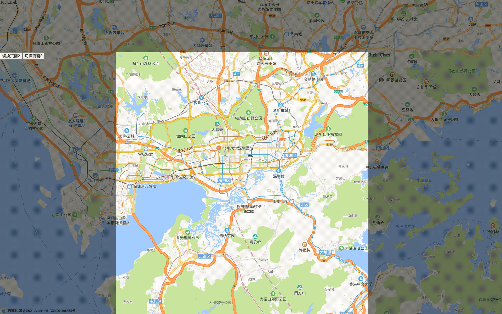
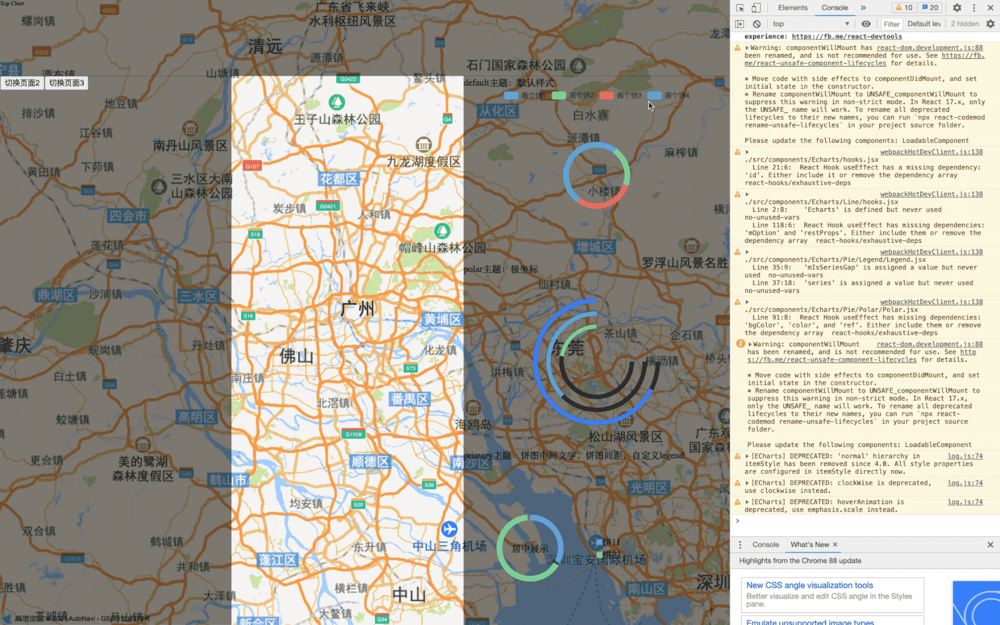
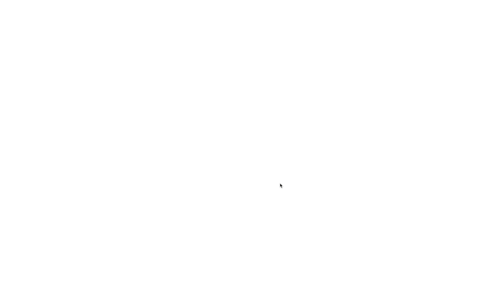

# ReactScaleView

## Introduction

ScaleView 组件库基于 React 封装，主要用于构建大屏（全屏）数据展示页面即数据可视化<br>
利用响应式的适配方式，不管是在 PC 端，还是投放到大屏上，不管是 1440\*768，1080p，还是 2k，4k 甚至更大分辨率的屏幕，都只需要 1 次适配，多屏幕兼容。<br>
以 UI 设计图为基准，适配好一个尺寸，理论上可以支持任意相似屏幕比例的屏幕<br>

###

<br>

### 响应式布局

<br>
在 1920px\*1080px 的画布上，即使缩小到 1440\*768，或者放大到 3840\*2160，所有内容将自动缩放成相应比例值，也无需重新适配<br>

## Install

npm: <code>npm i scale-view</code><br>
或<br>
yarn: <code>yarn add scale-view</code><br>

## Demo

1. yarn install
2. yarn start

## storybook

1. yarn install
2. yarn storybook

## Use

### 1. 创建容器

根据 UI 的设计图，创建相应的画布大小，画布大小一般为 1920px\*1080px<br>
在父组件中引入 ScaleViewContainer，将对容器内的所有子组件进行缩放处理<br>

**例 1**<br>

```javascript
import { ScaleViewContainer } from 'scale-view';

const Component = () => {
  return (
    <ScaleViewContainer
      config={{
        width: 1920, // (必选)容器宽度；如 1920，
        height: 1080, // (必选)容器高度；如 1080，
        scaleType: 'FULL_SCREEN',
      }}
    ></ScaleViewContainer>
  );
};
```

**例 2**<br>
<code>ScaleViewContainer</code> 与 <code>ScaleViewItem</code> 不一定是父子关系，也可以是爷孙关系。<br>
因此可以将 ScaleViewContainer 提取到最外层中，对全局组件进行适配<br>

```javascript
// 1. 新建配置文件, 如./config.js
export default {
  container: {
    width: 1920, // (必选)容器宽度；如 1920，
    height: 1080, // (必选)容器高度；如 1080，
    scaleType: 'FULL_SCREEN',
  },
};
```

```javascript
// 2. 实例化容器组件, 如./DemoDataV.js
import { ScaleViewContainer } from 'scale-view';
import Config from './config';

const DemoDataV = props => {
  return (
    <ScaleViewContainer
      config={Config.container}
      className={styles.scaleViewContainer}
    >
      <Switch>
        <Route
          path="/demo"
          exact
          render={() => <Redirect to="/demo/data-v1" />}
        />
        <Route path="/demo/data-v1" component={LoadableDataV1} />
        <Route path="/demo/data-v2" component={LoadableDataV2} />
        <Route path="/demo/data-v3" component={LoadableDataV3} />
      </Switch>
    </ScaleViewContainer>
  );
};

export default DemoDataV;
```

### 2. 创建子组件

**例 1**<br>

```javascript
import { ScaleViewContainer, ScaleViewItem } from 'scale-view';

const Parent = () => {
  return (
    <ScaleViewContainer
      config={{
        width: 1920, // (必选)容器宽度；如 1920，
        height: 1080, // (必选)容器高度；如 1080，
        scaleType: 'FULL_SCREEN',
      }}
    >
      <Children></Children>
    </ScaleViewContainer>
  );
};

const Children = () => {
  return (
    <ScaleViewItem
      config={{
        id: 'headerChart',
        style: { left: 0, top: 0, width: '100%', height: 200 },
        transition: {
          anim: 'slide',
          from: 'top',
          timeout: 300,
          delay: 100,
        },
        contentStyle: { background: 'rgba(0,0,0,0.5)' },
      }}
    ></ScaleViewItem>
  );
};
```

**例 2**

```javascript
// 1. 为了代码简介，可以吧配置信息统一放在配置文件中
// ./config.js
export default {
  topChart: {
    id: 'topChart',
    style: {
      left: 0,
      top: 0,
      right: 0,
      width: '100%',
      height: 200,
    },
    transition: {
      anim: 'slide',
      from: 'top',
      timeout: 300,
      delay: 300,
    },
    mode: 'adaptWidth',
  },
  leftChart: {
    id: 'leftChart',
    style: {
      left: 0,
      bottom: 0,
      width: 400,
    },
    transition: {
      anim: 'slide',
      from: 'left',
      timeout: 300,
      delay: 300,
    },
    mode: 'scaleXFix',
    relations: {
      layoutBelow: 'topChart',
    },
  },
  rightChart: {
    id: 'rightChart',
    style: {
      right: 0,
      bottom: 0,
      width: 460,
    },
    transition: {
      anim: 'slide',
      from: 'right',
      timeout: 300,
      delay: 300,
    },
    mode: 'scaleXFix',
    relations: {
      layoutBelow: 'topChart',
    },
  },
  mapChart: {
    style: {
      left: 0,
      top: 0,
      width: '100%',
      height: '100%',
    },
    mode: 'fixed',
  },
};
```

```javascript
// 2. 实例化组件，在页面中引入ScaleViewItem
import React, { useEffect } from 'react';
import { ScaleViewItem } from 'scale-view';
import { Map } from '@/components';
import Config from './config';
import styles from './DataV1.module.less';

const DataV1 = props => {
  return (
    <>
      <ScaleViewItem config={Config.mapChart}>
        <Map></Map>
      </ScaleViewItem>
      <ScaleViewItem config={Config.leftChart} contentClass={styles.leftChart}>
        LeftChart
      </ScaleViewItem>
      <ScaleViewItem config={Config.topChart} contentClass={styles.topChart}>
        Top Chart
      </ScaleViewItem>
      <ScaleViewItem
        config={Config.rightChart}
        contentClass={styles.rightChart}
      >
        Right Chart
      </ScaleViewItem>
    </>
  );
};

export default DataV1;
```

## Document

文档可参考 storybook，运行本项目命令 yarn storybook 即可看到相关文档

### 1. ScaleViewContainer

使用 ScaleViewContainer 作为大屏的容器组件，可以根据当前浏览器的像素宽高，将容器内的组件统一按照某个计算比值进行缩放。用户只需要按照设计稿还原 UI，使用该组件，可以在任何分辨率的浏览器中按比例尽可能还原。
| 参数 | 说明 | 类型 | 默认值 | 必选 |
| ------------ | ---------------------------------------- | ------ | ------ | ---- |
| config | 设置容器画布（内容区域）的尺寸及缩放模式 | object | 无 | 是 |
| style | 容器的样式 | object | 无 | 否 |
| className | 容器的 class | class | 无 | 否 |
| contentStyle | 容器画布（内容区域）的样式 | object | 无 | 否 |
| contentClass | 容器画布（内容区域）的 class | class | 无 | 否 |

#### 1.1 config

| 参数      | 说明                                                                                                                                                 | 类型   | 默认值 |
| --------- | ---------------------------------------------------------------------------------------------------------------------------------------------------- | ------ | ------ |
| width     | 容器宽度                                                                                                                                             | Number |        |
| height    | 容器高度                                                                                                                                             | Number |        |
| scaleType | 容器缩放模式：<code>FULL_SCREEN</code>适应全屏，<code>ADAPT_HEIGHT</code>宽度铺满，高度按比例缩放， <code>ADAPT_WIDTH</code>高度铺满，宽度按比例缩放 | String |        |

#### 2. ScaleViewItem

| 参数         | 说明                                                                                                                                                         | 类型   | 默认值   | 必选 |
| ------------ | ------------------------------------------------------------------------------------------------------------------------------------------------------------ | ------ | -------- | ---- |
| style        | Item 容器的样式                                                                                                                                              | object | 无       | 否   |
| mode         | Item 容器的缩放模式：<code>standard</code>,<code>fixed</code>,<code>scaleXFix</code>,<code>scaleYFix</code>,<code>adaptWidth</code>,<code>adaptHeight</code> | string | standard | 否   |
| transition   | 进场动画                                                                                                                                                     | object | 无       | 否   |
| relations    | Item 间相对关系                                                                                                                                              | object | 无       | 否   |
| className    | Item 容器的 class                                                                                                                                            | class  | 无       | 否   |
| contentStyle | Item 内容区域的样式                                                                                                                                          | object | 无       | 否   |
| contentClass | Item 内容区域的 class                                                                                                                                        | class  | 无       | 否   |
| config       | Item 统一设置（主要目的是减少组件参数数量）：<code>style</code><code>mode</code><code>transition</code><code>relations</code><code>contentStyle</code>       | object | 无       | 否   |

#### 2.1 mode 缩放模式

| 参数               | 说明                                                                                                                                                                                             | 类型   | 默认值 | 必选 |
| ------------------ | ------------------------------------------------------------------------------------------------------------------------------------------------------------------------------------------------ | ------ | ------ | ---- |
| mode='standard'    | 跟随容器缩放，不改变 item 的 width、height、scale（默认）                                                                                                                                        | string | 无     | 否   |
| mode='fixed'       | 跟随容器缩放，自动改变 item 的 width、height、scale。内容不会变形，但会被裁剪；使 item 大小不依赖 scale，而是通过改变宽高来适配；`建议仅在地图上使`用；                                          | string | 无     | 否   |
| mode='scaleXFix'   | 跟随容器缩放，不改变 item 的 width、height，不改变 scaleY，自动改变 scaleX。内容不会变形。保持 scaleY，通过调整 scaleX 来保持内容不变形。                                                        | string | 无     | 否   |
| mode='scaleYFix'   | 跟随容器缩放，不改变 item 的 width、height，不改变 scaleX，自动改变 scaleY。内容不会变形。保持 scaleX，通过调整 scaleY 来保持内容不变形。                                                        | string | 无     | 否   |
| mode='adaptWidth'  | 跟隨容器縮放，宽度相对固定，高度自动缩放。 当 container.scaleX / container.scaleY > 1 时，自动改变 width,scaleX；当 container.scaleX / container.scaleY < 1 时，自动改变 scaleY，内容不会变形；  | string | 无     | 否   |
| mode='adaptHeight' | 跟随容器缩放，高度相对固定，宽度自动缩放。当 container.scaleX / container.scaleY > 1 时，自动改变 scaleX；当 container.scaleX / container.scaleY < 1 时，自动改变 height, scaleY，内容不会变形； | string | 无     | 否   |

**注意：由于大多数地图 api 都对地图上的鼠标事件进行了监听处理，对组件进行 transform 变化时会出现偏移，使用 mode='fixed'可以解决这一问题**

#### 2.2 transition 进场动画

| 参数    | 说明                                                                                                      | 类型   | 默认值 | 必选 |
| ------- | --------------------------------------------------------------------------------------------------------- | ------ | ------ | ---- |
| anim    | 进场动画方式：<code>slide</code><code>opacity</code>                                                      | string | 无     | 是   |
| from    | 进场方向，仅当 anim='slide'时生效：<code>left</code><code>top</code><code>right</code><code>bottom</code> | string | 无     | 否   |
| timeout | 执行时间                                                                                                  | number | 无     | 是   |
| delay   | 延迟时间                                                                                                  | number | 无     | 否   |

```javascript
// 例如
const transition = {
  anim: 'slide',
  from: 'left',
  timeout: 150,
  delay: 150,
};
```

#### 2.3 relations Item 间相对关系

| 参数            | 说明                         | 类型   | 默认值 | 必选 |
| --------------- | ---------------------------- | ------ | ------ | ---- |
| layoutBelow: id | 位于 id 元素正下方           | string | 无     | 否   |
| layoutAbove: id | 位于 id 元素正上方           | string | 无     | 否   |
| toLeftOf: id    | 位于 id 元素左边             | string | 无     | 否   |
| toRightOf: id   | 位于 id 元素右边             | string | 无     | 否   |
| alignLeft: id   | 左边界与 id 元素的左边界对齐 | string | 无     | 否   |
| alignRight: id  | 右边界 id 元素的右边界对齐   | string | 无     | 否   |
| alignTop: id    | 上边界与 id 上边界对齐       | string | 无     | 否   |
| alignBottom: id | 下边界与 id 下边界对齐       | string | 无     | 否   |

```javascript
// 例如
const relations = {
  layoutBelow: 'chart1',
  layoutAbove: 'chart2',
};
```

### 3. ScaleViewContext

当组件不在 ScaleViewContainer 的子组件中，而在孙子组件中，由于使用 ScaleViewItem 层级嵌套太多容易出现样式错乱问题，这时可以使用 ScaleViewContext 来获取 ScaleViewContainer 的容器参数，来对组件做适配。
**注意：ScaleViewContext 与 ScaleViewContainer 必须在同一上下文**

```javascript
import React from 'react';
import { ScaleViewContext } from 'scale-view';

const ContextDemo = props => {
  return (
    <ScaleViewContext.Consumer>
      {({ size }) => {
        return (
          <div style={{ fontSize: 40 }}>
            <div>size.scaleX: {size.scaleX}</div>
            <div>size.scaleY: {size.scaleY}</div>
            <div>size.width: {size.width}</div>
            <div>size.height: {size.height}</div>
          </div>
        );
      }}
    </ScaleViewContext.Consumer>
  );
};

export default ContextDemo;
```

### 4. useSize

<code>useSize</code> 使用 hooks 方式获取容器参数

```javascript
import React from 'react';
import { useSize } from 'scale-view';

const Demo = props => {
  const size = useSize();
  return (
    <div style={{ fontSize: 40 }}>
      <div>size.scaleX: {size.scaleX}</div>
      <div>size.scaleY: {size.scaleY}</div>
      <div>size.width: {size.width}</div>
      <div>size.height: {size.height}</div>
    </div>
  );
};

export default ContextDemo;
```

### 5. withSize

<code>withSize</code> 使用 HOC 方式注入容器参数

```javascript
import React from 'react';
import { withSize } from 'scale-view';

const Demo = props => {
  const { size } = props;
  return (
    <div style={{ fontSize: 40 }}>
      <div>size.scaleX: {size.scaleX}</div>
      <div>size.scaleY: {size.scaleY}</div>
      <div>size.width: {size.width}</div>
      <div>size.height: {size.height}</div>
    </div>
  );
};

export default withSize(ContextDemo);
```

#### 完整例子

```javascript
import React, { Component } from 'react';
import { ScaleViewContainer, ScaleViewItem } from 'scale-view';
import './App.css';
class App extends Component {
  render() {
    return (
      <ScaleViewContainer
        config={{
          width: 1920, // (必选)容器宽度；如 1920，
          height: 1080, // (必选)容器高度；如 1080，
          scaleType: 'FULL_SCREEN',
        }}
      >
        <ScaleViewItem
          config={{
            id: 'headerChart',
            style: { left: 0, top: 0, width: '100%', height: 200 },
            transition: {
              anim: 'slide',
              from: 'top',
              timeout: 300,
              delay: 100,
            },
            contentStyle: { background: 'rgba(0,0,0,0.5)' },
          }}
        ></ScaleViewItem>
        <ScaleViewItem
          config={{
            style: { left: 0, top: 0, bottom: 0, width: 450 },
            transition: {
              anim: 'slide',
              from: 'left',
              timeout: 300,
              delay: 100,
            },
            contentStyle: { background: 'rgba(0,0,0,0.5)' },
            relations: {
              layoutBelow: 'headerChart',
            },
          }}
        ></ScaleViewItem>
        <ScaleViewItem
          config={{
            style: { right: 0, top: 0, bottom: 0, width: 450 },
            transition: {
              anim: 'slide',
              from: 'right',
              timeout: 300,
              delay: 100,
            },
            contentStyle: { background: 'rgba(0,0,0,0.5)' },
            relations: {
              layoutBelow: 'headerChart',
            },
          }}
        ></ScaleViewItem>
      </ScaleViewContainer>
    );
  }
}

export default App;
```

**运行效果**<br>
<br>

**注意：在开发中使用一些第三方的 UI 库或 API 时，往往会脱离上下文（Context），或在 ScaleViewContainer 外渲染组件**<br>
**如：**<br>
**1. ant-design 会选在 body 下渲染 modal，popcontainer 等**<br>
**2. 如在地图上创建图标（Marker），海量图（MassMark），弹窗（InfoWindow）等**<br>
**导致这些组件脱离了 ScaleViewContainer 适配范围。针对这些情况，可以使用<code>ScaleViewContext</code>，<code>useSize</code>，<code>withSize</code>获取 ScaleViewContainer 的缩放比例及容器大小，对第三方组件进行 transform 变化。**<br>
